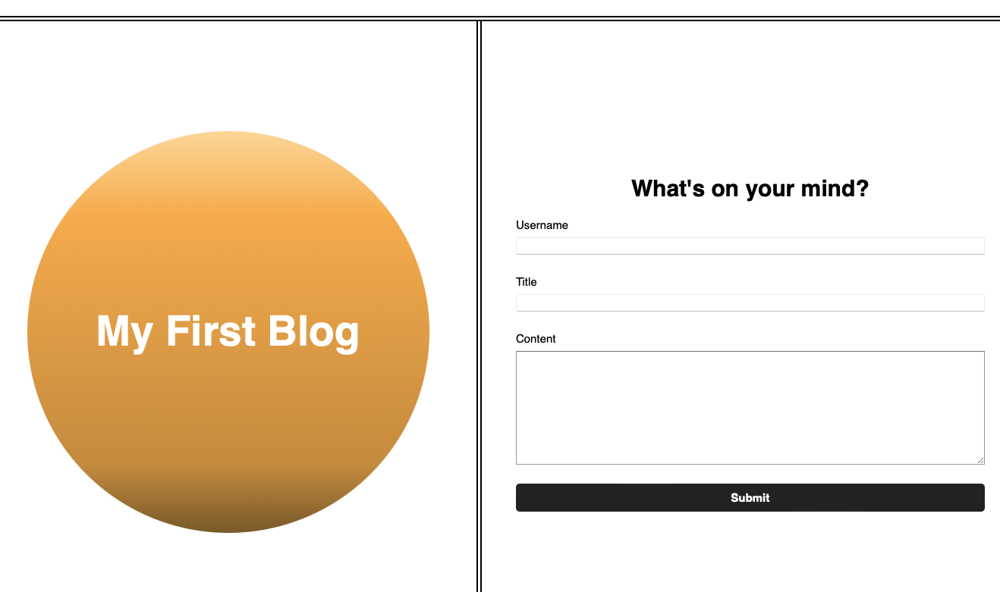
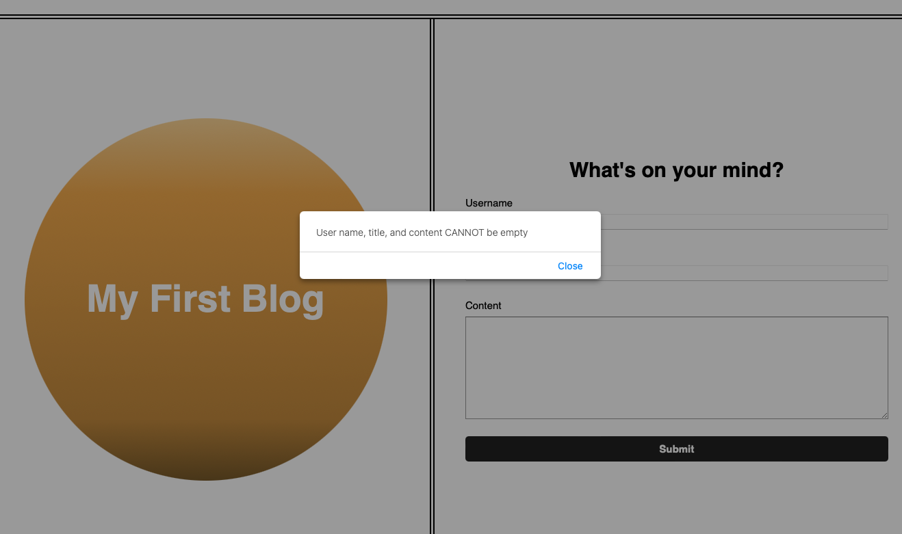
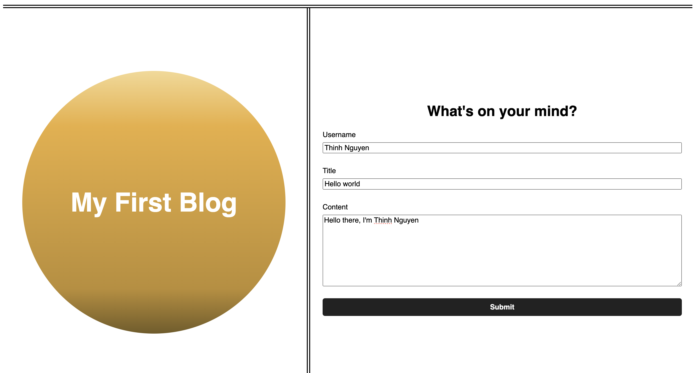
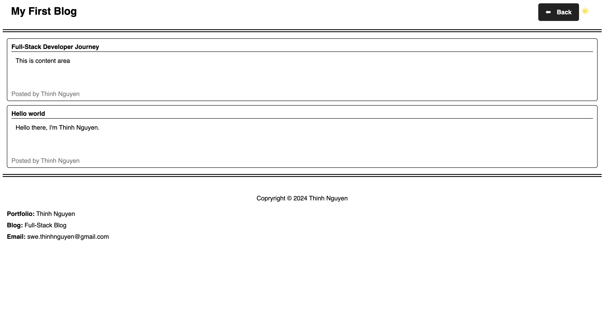

# 04 Web APIs: Personal Blog

## Achivement
The website has all basic functions, such as mode change, submit form, and redirect users to blog page. It also complains users when they try to submit form without data, so error won't raise. Here is the website link: https://swe-thinhnguyen1701.github.io/my-blog/index.html

## Main page

Figure: Main page.

## Handle Exception
```
WHEN user try to submit form without entering input.
THEN the system will pop up an alert to let users know what's wrong.
```
**Note:** empty string (space only) is also considered as invalid input


## Valid Input
```
WHEN user full fills data
THEN the system will store data to local storage, then it will remove leading and traling space if possible. Lastly, it will display data on blog page.
```

